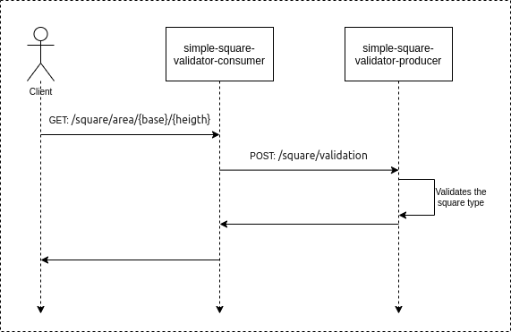

# Simple square validator
Simple POC of api contract test.

The poc is composed of two applications: one producer (simple-square-validator-producer) and one consumer (simple-square-validator-consumer). 

The consumer receives the client request that contains the base and the height of a suposed square and calls the producer for validation. 

The producer process the request executing a simple square validation (only for academic purpose) and returns:

- SQUARE (if the base and height are equals)

- RECTANGLE (if the base and height are differents)

- NON_VALID_SQUARE (if the base or the height are negative)

## Sequence diagram

  

## Prerequisites
:warning: java

## Usage
#### Maybe you just want to run using the spring boot plugin:

- mvn spring-boot:run (for both applications)
- GET (on consumer) http://{host}:{port}/api/v1/square/{squareBase}/{squareHeigth}

:memo: Packing and running tests:

✔️First execute 'mvn clean install' on the producer application (simple-square-validator-producer), than the tests are executed and the stub is generated in the local maven repository

✔️Than execute 'mvn clean install' on the consumer applicatin (simple-square-validator-consumer), than the tests are executed using the stub generated previously.